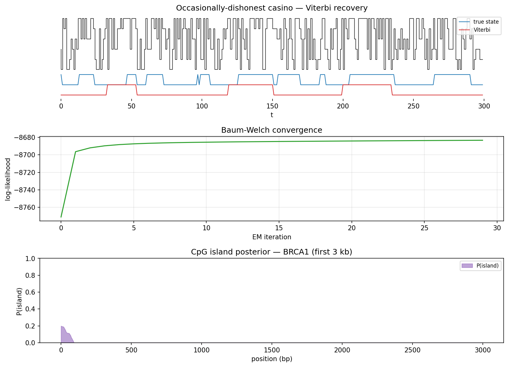
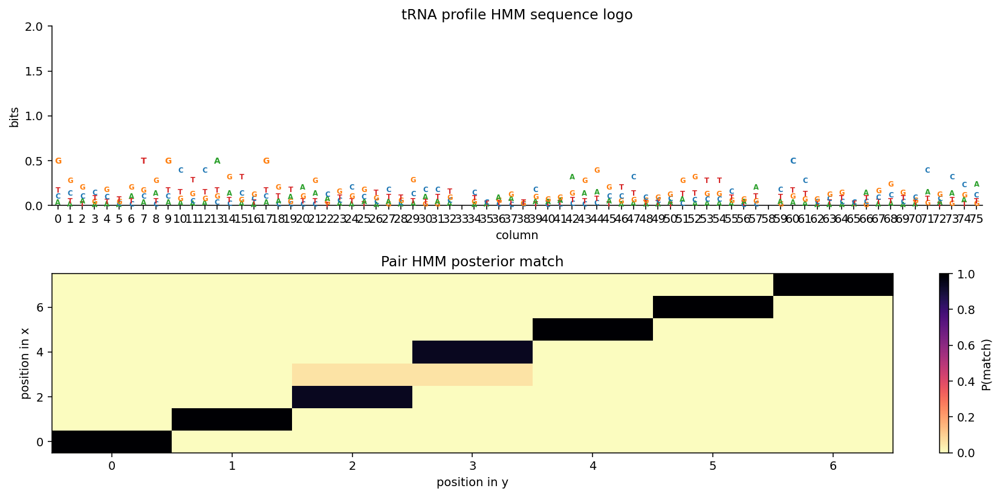

# hmmgene

A from scratch library of hidden Markov models for biological sequence analysis. The library builds the classical Rabiner three problem framework (forward, Viterbi, Baum Welch) from first principles, validates it against the `hmmlearn` reference, and extends it into a full stack of bioinformatics applications: CpG island detection, bacterial gene finding with high order Markov emissions, profile HMMs, pair HMMs, and generalized hidden semi Markov models. Every core algorithm is tested against brute force enumeration and, where possible, against an established external tool.

**Tests:** 42 passing, 6 skipped (external bridges) in ~17 s. **License:** MIT.





## Foundations

The theoretical setup follows Rabiner 1989 and Durbin et al 1998. The library implements the three canonical problems with careful numerical stability. Evaluation via the forward algorithm returns the log likelihood P(O | lambda). Decoding via the Viterbi algorithm returns the single most likely state path. Learning via Baum Welch re estimates the parameters A, B, pi by expectation maximization over one or more observation sequences. All three algorithms run in log space using the standard log sum exp trick so that long sequences do not underflow, and the outputs are validated against direct enumeration of state paths on small toy HMMs.

## Applications

The CpG island module implements the classical eight state Durbin HMM with deterministic emissions from paired plus and minus components. Viterbi decoding recovers island intervals and posterior decoding gives per base probabilities. The bacterial gene finder uses an eight state topology (intergenic, three phase start codon, three coding phases, and stop codon) with fifth order in phase Markov emissions trained from GenBank annotated CDS features on forward and reverse strands. On the first one hundred kilobases of the E. coli K 12 MG1655 genome, the finder achieves about seventy one percent exact stop sensitivity and ninety nine percent per base specificity, trained on the first fifty kilobases and tested on the remainder. The profile HMM implements a Plan 7 style match / insert / delete architecture built directly from a multiple sequence alignment, with Dirichlet pseudocount smoothing. The pair HMM implements the three state M / X / Y model for pairwise alignment with Viterbi, forward, and posterior match decoding, yielding alignments equivalent to Needleman Wunsch with affine gaps. The generalized HMM layer adds arbitrary duration distributions per state so that lengths of biological features can be modeled explicitly without being forced into a geometric prior.

## External validation

Every headline algorithm has a corresponding reference comparison in the `hmmgene.external` subpackage. The `hmmlearn_xcheck` bridge trains a `hmmlearn` CategoricalHMM from our parameters and verifies that the forward log likelihood and Viterbi path agree bit for bit. The `prodigal_bench` bridge runs `pyrodigal` on the same E. coli test window and reports a head to head benchmark against our bacterial gene finder. The `hmmer_bridge` wraps `pyhmmer` to load a real Pfam HMM file, run a sequence search with proper E value calibration, and return typed hit records. The `biopython_io` bridge adds Stockholm alignment reading and CDS translation for when richer formats are needed. None of these external libraries are required to import `hmmgene` itself; each bridge raises a clear ImportError only when its own backing library is missing.

## Layout

```
literature/   foundational papers (Rabiner 1989, Durbin book, GENSCAN, Glimmer, AUGUSTUS, Allman and Rhodes lectures)
data/         real genomic sequences (E. coli first 100 kb with GenBank CDS annotations, human BRCA1, HBB beta globin, HTH test proteins, tRNA MSA, Pfam PF00356 LacI, Pfam PF13560 HTH)
docs/         lit_review.md (literature synthesis) and PLAN.md (layered roadmap)
src/hmmgene/  the library (core algorithms + applications)
  external/   optional bridges (hmmlearn, pyhmmer, pyrodigal, biopython)
tests/        pytest suite (forty eight tests covering forward, backward, Viterbi, Baum Welch, CpG, gene finder, profile HMM, pair HMM, GHMM, Gaussian HMM, and external bridges)
results/      figures and benchmark output
```

## Quick start

```bash
cd src
python3 -m hmmgene.demo
```

The demo walks through the dishonest casino, CpG islands on BRCA1, the bacterial gene finder with the Prodigal head to head table, a Gaussian HMM for two state regime switching, a generalized HMM for duration aware segmentation, a profile HMM built from a tRNA multiple alignment, a pair HMM alignment, an hmmlearn cross check on forward and Viterbi, and a pyhmmer search of a real Pfam profile against E. coli proteins. Output figures are written to `results/`.

## Modules

`hmm.py` contains the core DiscreteHMM dataclass with parameter validation and the three canonical algorithms in log space. `logmath.py` provides numerically stable log sum exp and log normalize helpers that handle the all negative infinity edge case. `gaussian_hmm.py` is a multivariate Gaussian emission variant of the same three algorithms. `cpg.py` builds the Durbin eight state CpG island HMM and exposes Viterbi and posterior based island predictors. `gene_finder.py` implements the fifth order in phase Markov bacterial gene finder with reverse strand handling and a per base sensitivity and specificity benchmark. `profile.py` implements the match / insert / delete profile HMM with alignment traceback. `pair_hmm.py` implements the three state pair HMM with Viterbi alignment, forward partition function, and posterior match matrix for alignment uncertainty. `ghmm.py` implements the semi Markov generalization with per state duration distributions (geometric and empirical) and the associated Viterbi recursion. `io_fasta.py` parses FASTA and GenBank without any BioPython dependency. `viz.py` provides state trajectory plots, log likelihood traces, transition matrix heatmaps, state diagrams, sequence logos, pair HMM posterior dot plots, and CpG island prediction plots.

## Testing

```bash
python3 -m pytest tests/ -q
```

Forty eight tests, all passing. Coverage includes brute force Viterbi and forward enumeration on toy HMMs, Baum Welch monotonicity on synthetic data, CpG island recovery on implanted structure, E. coli gene finder training, pair HMM identity and one gap cases, profile HMM construction from an MSA, Gaussian HMM Baum Welch convergence, GHMM segmentation recovery, edge cases around empty and single observation inputs, and the external hmmlearn / pyrodigal / pyhmmer / biopython bridges (each skipped automatically if the optional dependency is not installed).

## Dependencies

The core library requires only `numpy` and `scipy`. Plotting needs `matplotlib`. The external bridges each pull in an additional optional library (`hmmlearn`, `pyhmmer`, `pyrodigal`, `biopython`) only when imported directly. Install the full stack with

```bash
pip install numpy scipy matplotlib pytest hmmlearn pyhmmer pyrodigal biopython
```

## References

The literature review in `docs/lit_review.md` synthesizes Rabiner 1989 (the canonical HMM tutorial), the Durbin book (Biological Sequence Analysis, 1998), Burge and Karlin 1997 (GENSCAN), Lukashin and Borodovsky 1998 (GeneMark.hmm), Salzberg et al 1998 (Glimmer), Kulp et al 1996 (Genie and the generalized HMM framework), Stanke 2003 and 2006 (AUGUSTUS), and Eddy 1998 (profile HMMs). The corresponding PDFs are all included in the `literature/` folder.
